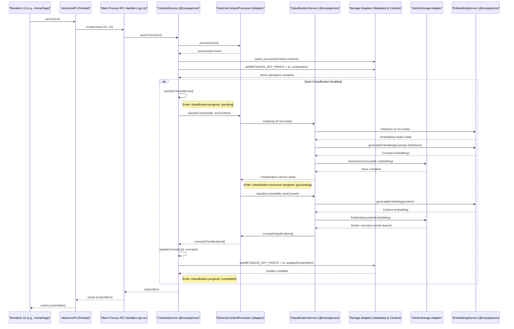
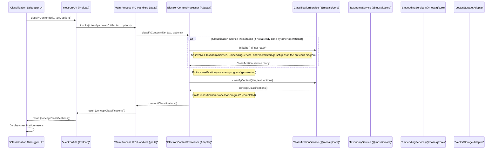

# Design & Code Review Report: Knowledge & Learning Management Application

## 1. Overall Summary & Impression

The Knowledge & Learning Management application is a well-architected and sophisticated piece of software. It demonstrates a strong commitment to modern development practices, including a modular monorepo structure, extensive use of TypeScript, a clear separation of concerns, and a robust local-first approach to data and AI processing. The project is ambitious, incorporating complex features like local AI-driven content classification and a platform abstraction layer for future flexibility. The codebase is generally clean, readable, and shows evidence of thoughtful design. While there are areas for improvement, the foundations are very solid.

## 2. Key Strengths

*   **Architecture & Modularity:**
    *   Excellent monorepo structure (`packages/*`) with clear separation of concerns between UI (`common-ui`), core logic (`core`), desktop integration (`desktop-app`), and platform services (`platform-abstractions`).
    *   The `platform-abstractions` package is a significant strength, allowing for clean decoupling and easier future adaptation to other platforms.
    *   The detailed `docs/architecture.md` is largely accurate and immensely helpful for understanding the system.
*   **TypeScript Usage & Code Quality:**
    *   Comprehensive TypeScript adoption provides strong typing and improves code maintainability.
    *   Code is generally well-formatted, readable, and follows consistent naming conventions.
    *   Good use of modern JavaScript features (async/await, classes, modules).
*   **Electron Security Best Practices:**
    *   `contextIsolation: true`, `nodeIntegration: false`, and the use of a `preload.ts` with `contextBridge` demonstrate a strong security posture for the Electron environment.
*   **AI/ML Integration:**
    *   Sophisticated local AI processing capabilities with hybrid classification (text-based + embeddings via MiniLM/ONNX Runtime).
    *   `ClassificationService`, `EmbeddingServiceFactory`, and related components in `packages/core` are well-implemented.
    *   Features like caching concept embeddings and background classification are good for performance and UX.
*   **Error Handling (Backend):**
    *   Consistent `try-catch` error handling in `packages/core` services and `packages/desktop-app` IPC handlers, with errors typically logged and re-thrown for upstream handling.
*   **Build Process (TypeScript):**
    *   Excellent TypeScript project reference setup (`tsconfig.json` solution file, `tsconfig.base.json`, per-package tsconfigs) enables efficient and correct incremental builds.
*   **Documentation:**
    *   High-quality `architecture.md`.
    *   Good JSDoc-style comments for public APIs and interfaces. Inline comments clarify complex sections.
*   **Testing (Foundations):**
    *   Presence of unit tests for core services and utilities using Jest is a positive sign of testing culture.

## 3. Areas for Improvement & Recommendations

### 3.1. Critical Priority

*   **Performance of Vector Search (`LocalVectorAdapter.findSimilar`):**
    *   **Issue:** The current brute-force cosine similarity search will not scale with a growing number of documents/concepts. This is the most significant technical bottleneck.
    *   **Recommendation:** Implement an Approximate Nearest Neighbor (ANN) search library (e.g., HNSWlib.js, Faiss compiled to WASM, or a dedicated local vector DB). This is crucial for maintaining performance as the knowledge base grows. (Noted in a TODO in the code).

### 3.2. High Priority

*   **Content Security Policy (CSP) Hardening (`main.ts`):**
    *   **Issue:** The CSP includes `'unsafe-inline'` and `'unsafe-eval'` for `script-src`, and `'unsafe-inline'` for `style-src`. `img-src https:` is very broad.
    *   **Recommendation:**
        *   Investigate removing `'unsafe-eval'` for production builds.
        *   Attempt to remove `'unsafe-inline'` for scripts and styles.
        *   Restrict `img-src https:` to known domains if possible.
*   **User-Facing Error Handling (UI):**
    *   **Issue:** Errors from asynchronous operations are often only logged to the console in the UI layer.
    *   **Recommendation:** Implement a more robust and user-friendly error display mechanism (e.g., toast notifications, error dialogs).
*   **Webpack Configuration (`packages/desktop-app/webpack.config.js`):**
    *   **Issue:** Single Webpack config seems geared for development. Main/preload process bundling strategy is unclear.
    *   **Recommendation:** Create separate Webpack configurations for development and production. Clarify/implement Webpack bundling for main and preload scripts.
*   **Build Script `ensureNodeModules` (`scripts/build.js`):**
    *   **Issue:** Manual symlinking of workspace dependencies is error-prone.
    *   **Recommendation:** Remove `ensureNodeModules()`. Rely on the package manager's workspace functionality.

### 3.3. Medium Priority

*   **Type Safety for IPC & Contexts:**
    *   **Issue:** Usage of `any` for options/payloads in `preload.ts` and `common-ui` Context types.
    *   **Recommendation:** Replace `any` with specific interfaces from `packages/platform-abstractions`.
*   **Resource Path Standardization (Main Process):**
    *   **Issue:** Inconsistent methods for constructing resource paths (`__dirname` vs. `app.getAppPath()`).
    *   **Recommendation:** Consistently use `app.getAppPath()` for resolving resource paths in the main process.
*   **`ElectronDialogService.showPromptDialog` Implementation:**
    *   **Issue:** Currently a placeholder.
    *   **Recommendation:** Implement a proper custom prompt window if required.
*   **Testing Enhancements (`packages/core`):**
    *   **Recommendation:** Improve determinism in `ClassificationService.test.ts` mocks. Add dedicated tests for `TextBasedClassifier.ts`. Expand `ContentService.test.ts` for classification methods/events.
*   **Performance of Batch Embeddings (`MiniLMEmbeddingService.generateEmbeddings`):**
    *   **Issue:** Processes texts sequentially.
    *   **Recommendation:** Investigate true batch processing with ONNX runtime.
*   **Styling Consistency & Refinement (`packages/common-ui`):**
    *   **Issue:** Mix of CSS files and extensive inline styles in some components.
    *   **Recommendation:** Refactor more static inline styles into CSS files.

### 3.4. Low Priority / General Housekeeping

*   **Redundant Build Scripts:** Consolidate build script entry points.
*   **Heuristics in `TextBasedClassifier`:** Document thoroughly; consider making them more configurable or data-driven.
*   **`ContentService.generateId()`:** Switch to UUIDs if cross-instance syncing is envisioned.
*   **`ContentService` HTML to Text for Classification:** Ensure cleaned, readable HTML is used, or improve the stripping process.
*   **Accessibility (ARIA for Clickable Divs):** Ensure clickable non-button/anchor elements have appropriate ARIA roles and `tabIndex`.
*   **Electron Packaging Review:** Conduct a review of Electron Forge/Builder configuration.
*   **Dependency Audit:** Perform routine audits.

## 4. Conclusion

This application is built on a strong architectural foundation with many well-implemented features. The development team has shown a clear understanding of modern software engineering principles. Addressing the critical performance issue with vector search and continuing to refine security and UI error handling will significantly enhance the application's robustness and user experience. The existing modularity and code quality provide an excellent base for future development and feature expansion.

## 5. System Architecture Diagram

```mermaid
graph TD
    subgraph UserInterface["User Interface"]
        DesktopApp_Renderer["packages/desktop-app (Renderer)"]
        CommonUI["packages/common-ui"]
    end

    subgraph MainProcess["Main Process & Core Logic"]
        DesktopApp_Main["packages/desktop-app (Main)"]
        CoreServices["packages/core"]
        PlatformAbstractions["packages/platform-abstractions"]
    end

    subgraph DataAndModels["Data & Models"]
        ElectronStore["Electron Store (Settings, Metadata)"]
        FileSystem_Content["File System (Content Cache)"]
        VectorDB["Local Vector DB (Embeddings)"]
        Models["ML Models (ONNX)"]
        TaxonomyFile["Taxonomy File (JSON/SKOS)"]
    end

    DesktopApp_Renderer -- IPC via Preload --> DesktopApp_Main
    CommonUI -- Used by --> DesktopApp_Renderer

    DesktopApp_Main -- Uses --> CoreServices
    DesktopApp_Main -- Implements & Uses --> PlatformAbstractions
    CoreServices -- Uses Abstractions from --> PlatformAbstractions
    CoreServices -- Uses --> VectorDB
    CoreServices -- Uses --> Models
    CoreServices -- Uses --> TaxonomyFile

    DesktopApp_Main -- Manages --> ElectronStore
    DesktopApp_Main -- Manages --> FileSystem_Content

    classDef electronApp fill:#D6EAF8,stroke:#2980B9,stroke-width:2px;
    classDef coreLogic fill:#E8DAEF,stroke:#8E44AD,stroke-width:2px;
    classDef uiElements fill:#D5F5E3,stroke:#229954,stroke-width:2px;
    classDef dataStores fill:#FDEDEC,stroke:#CB4335,stroke-width:2px;

    class DesktopApp_Renderer,DesktopApp_Main electronApp;
    class CoreServices,PlatformAbstractions coreLogic;
    class CommonUI uiElements;
    class ElectronStore,FileSystem_Content,VectorDB,Models,TaxonomyFile dataStores;
end
```

This diagram shows:
- The main packages: `packages/desktop-app` (split into Main and Renderer for clarity), `packages/common-ui`, `packages/core`, and `packages/platform-abstractions`.
- Key data stores and resources like Electron Store, File System, Vector DB, ML Models, and the Taxonomy File.
- High-level interactions, such as IPC communication, UI component usage, core logic utilization, and data access.

This should provide a good visual overview of the system components.

## 6. Key Sequence Diagrams

### 6.1. Content Saving & Initial Classification Flow

This diagram shows the sequence of operations when a user saves a URL, which then gets processed, stored, and automatically classified.



### 6.2. Classification Debugger Flow

This diagram illustrates how the Classification Debugger UI might allow a user to input arbitrary text and see the classification results.



These diagrams should help clarify the interactions for the specified flows.
